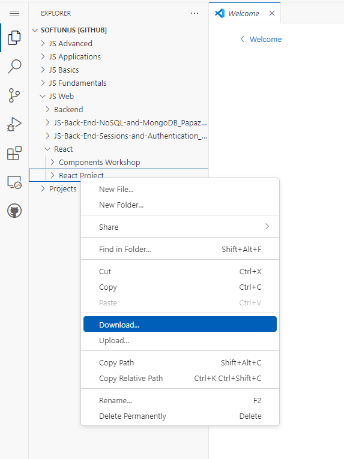

# Project Title - TradeVault

This project is part of the JavaScript Softuni path and aims to demonstrate my knowledge and skills of creating SPA application with React.

## Table of Contents
- [Installation](#installation)
- [Usage](#usage)
- [Features](#features)
- [Contributing](#contributing)
- [License](#license)
- [Contact](#contact)

## Installation

### Prerequisites
- Software or libraries required (Node.js)

### Steps
1. Download the project folder from the repository
    ```bash
    go to https://github.dev/crystal-wolfer/SoftUniJS/tree/main/JS%20Web/React/React%20Project
    ```
    
2. Navigate to the project directory
    ```bash
    cd yourproject
    ```
3. Install dependencies
    ```bash
    pip install -r requirements.txt
    ```

## Usage

### Running the Project
Provide clear instructions on how to run the project.
```bash
